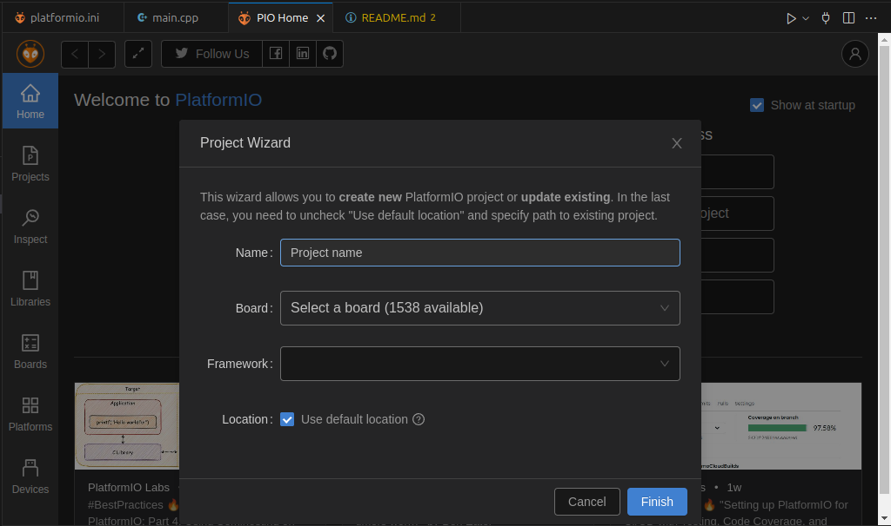

# 🌾 Fazenda IoT

Projeto baseado em ESP32 para monitoramento ambiental e envio de dados via MQTT para a plataforma ThingsBoard.

---

## 📦 Tecnologias e Bibliotecas

- **ESP32** (placa `esp32dev`)
- **PlatformIO + VS Code**
- **WiFiManager** – configuração facilitada de Wi-Fi
- **DHT.h** – leitura de temperatura e umidade
- **PubSubClient** – comunicação via MQTT
- **ThingsBoard** – dashboard IoT

---

## ⚙️ Esquema de Hardware

- **Sensor DHT11**: temperatura e umidade — pino `33`
- **Sensor de Gás**:
  - Analógico — pino `39`
  - Digital — pino `4`
- **LEDs**:
  - Vermelho — pino `32`
  - Verde — pino `26`
- **Relé** — pino `23`

---

## 🚀 Como usar

### 1. Clone o repositório

```bash
git clone https://github.com/ivoriegel/fazendaiot
cd fazendaiot
```

### 2. Abra com o PlatformIO

Abra a pasta do projeto no VS Code com a extensão PlatformIO instalada.

### 3. Instale as dependências

O PlatformIO cuida disso automaticamente com base no `platformio.ini`.

### 4. Configure o token do ThingsBoard

No arquivo `src/main.cpp`, substitua:

```cpp
const char *token = "token do dispositivo criado";
```

Pelo **token real** do seu dispositivo ThingsBoard.

### 5. Compile e envie para o ESP32

Com o ESP32 conectado, clique em "Upload" no PlatformIO ou rode:

```bash
pio run --target upload
```

### 6. Acompanhe pelo monitor serial

```bash
pio device monitor
```

---

## 📡 Telemetria enviada

O ESP32 envia os dados para:

```
v1/devices/me/telemetry
```

Exemplo de payload JSON publicado via MQTT:

```json
{
  "temperatura": 23.5,
  "umidade": 56.2,
  "gás": 374
}
```

---

## 🐧 Como usar PlatformIO no Linux com VS Code

Se você está usando Linux e quer programar com ESP32 no VS Code usando o **PlatformIO**, siga o passo a passo abaixo. Ele cobre tanto o caso comum onde o PlatformIO **não aparece no Marketplace**, quanto o caminho padrão.

---

### ✅ 1. Tente instalar pelo Marketplace (caso já apareça)

1. Abra o **VS Code**
2. Vá até a aba de **Extensões (Ctrl+Shift+X)**
3. Pesquise por **PlatformIO IDE**
4. Se aparecer, clique em **Instalar**

Se deu certo, pule direto para a seção [Crie um novo projeto PlatformIO](#2-crie-um-novo-projeto-platformio).

---

### ❌ 1.1 Se NÃO aparecer o PlatformIO no Marketplace

#### 📦 Instale via pipx (mais seguro que pip)

O `pip` puro pode causar erros com dependências. O recomendado é usar `pipx`, que isola o ambiente:

#### 1. Instale o `pipx`:

```bash
sudo apt update
sudo apt install pipx
pipx ensurepath
```

Reinicie o terminal.

#### 2. Instale o PlatformIO via `pipx`:

```bash
pipx install platformio
```

Agora, você pode usar o `platformio` direto no terminal VS Code (ou qualquer terminal Linux).

---

### 📁 2. Crie um novo projeto PlatformIO

1. No VS Code, vá até o menu lateral esquerdo e clique no **formigueiro** do PlatformIO.
2. Clique em **“New Project”**
3. Dê um nome ao projeto (ex: `fazendaiot`)
4. Selecione:
   - **Placa:** `ESP32 Dev Module`
   - **Framework:** `Arduino`
5. Clique em **Finish**




---

### 🧾 3. Substitua ou renomeie o `.ino`

Se você já tinha um arquivo `.ino` (do Arduino IDE), faça o seguinte:

1. Mova o conteúdo para `src/main.cpp`
2. Ou **renomeie o arquivo `.ino` para `main.cpp`** se ele estiver dentro da pasta `src/`

> ⚠️ O PlatformIO exige que o arquivo principal esteja nomeado como `main.cpp`.

---

### ⚙️ 4. Configure a placa, porta e monitor serial

Abra o arquivo `platformio.ini` e edite (ou confirme) o seguinte:

```ini
[env:esp32dev]
platform = espressif32
board = esp32dev
framework = arduino
monitor_speed = 115200
upload_port = /dev/ttyUSB0
```

> 📝 A porta (`upload_port`) pode mudar. Use `ls /dev/tty*` antes e depois de conectar o ESP32.

---

### 🚀 5. Compile e envie o código

Com o ESP32 conectado:

- Clique no **check (✔)** para **compilar**
- Clique na **seta (→)** para **enviar**

Ou use:

```bash
pio run --target upload
```

---

### 🔍 6. Monitor serial

Para visualizar os dados do ESP32:

```bash
pio device monitor
```

---

### 🔁 7. Enviar e monitorar de uma vez

Use este comando para enviar o código e abrir o monitor serial automaticamente:

```bash
pio run --target upload && pio device monitor
```

---

### 🧩 Dicas finais

- Se a porta USB der erro de permissão:

```bash
sudo usermod -aG dialout $USER
# Reinicie a máquina depois
```

- Se o terminal do PlatformIO não abrir, use o terminal embutido do VS Code (`Ctrl + ``).
- Certifique-se de que o cabo USB suporta **dados**, não só **carga**.

---

Pronto! Com esses passos, você já consegue usar PlatformIO no Linux via VS Code para programar ESP32 como um profissional! 🚀🐧


## 🤝 Contribua

Contribuições são bem-vindas! Abra uma *issue* com bugs ou sugestões, ou envie um *pull request* com melhorias.

---

## 📜 Licença

Este projeto está licenciado sob os termos da licença MIT. Veja o arquivo `LICENSE` para mais detalhes.
